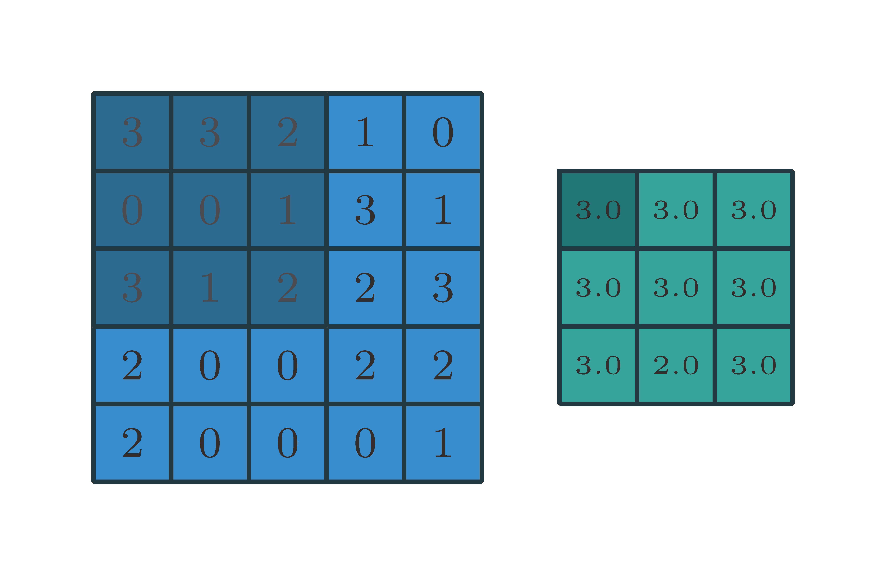

# Convolution arithmetic

A technical report on convolution arithmetic in the context of deep learning.
<p align="center"></p>
## Convolution animations

<table style="width:100%">
  <tr>
    <td></td>
    <td></td>
    <td></td>
    <td></td>
  </tr>
  <tr>
    <td>No padding, no strides</td>
    <td>Arbitrary padding, no strides</td>
    <td>Half padding, no strides</td>
    <td>Full padding, no strides</td>
  </tr>
  <tr>
    <td></td>
    <td></td>
    <td></td>
    <td></td>
  </tr>
  <tr>
    <td>No padding, no strides, transposed</td>
    <td>Arbitrary padding, no strides, transposed</td>
    <td>Half padding, no strides, transposed</td>
    <td>Full padding, no strides, transposed</td>
  </tr>
  <tr>
    <td></td>
    <td></td>
    <td></td>
    <td></td>
  </tr>
  <tr>
    <td>No padding, strides</td>
    <td>Padding, strides</td>
    <td>Padding, strides (odd)</td>
    <td></td>
  </tr>
  <tr>
    <td></td>
    <td></td>
    <td></td>
    <td></td>
  </tr>
  <tr>
    <td>No padding, strides, transposed</td>
    <td>Padding, strides, transposed</td>
    <td>Padding, strides, transposed (odd)</td>
    <td></td>
  </tr>
  <tr>
    <td></td>
    <td></td>
    <td></td>
    <td></td>
  </tr>
  <tr>
    <td>No padding, no stride, dilation</td>
    <td></td>
    <td></td>
    <td></td>
  </tr>
</table>

## Generating the Makefile

From the repository's root directory:

``` bash
$ ./bin/generate_makefile
```
## Generating the animations

From the repository's root directory:

``` bash
$ make all_animations
```

The animations will be output to the `gif` directory. Individual animation steps
will be output in PDF format to the `pdf` directory and in PNG format to the
`png` directory.

## Compiling the document

From the repository's root directory:

``` bash
$ make
```
h[:, :, 19:19+x.size()[2], 19:19+x.size()[3]].contiguous()
1111

<script type="text/javascript">
$(document).ready(function(){
  $("code").map(function(){
    match = /^\$(.*)\$$/.exec($(this).html());
    if (match){
      //$(this).after("<span class=mathjax_inline>" + match + "</span>");
      //$(this).hide();
      $(this).replaceWith("<span class=hpl_mathjax_inline>" + $(this).html() + "</span>");
      MathJax.Hub.Queue(["Typeset",MathJax.Hub,$(this).get(0)]);
    }
  });
});
</script>

<script type="text/javascript"
  src="https://cdn.mathjax.org/mathjax/latest/MathJax.js?config=TeX-AMS-MML_HTMLorMML">
</script>

<p>$$x=\frac{-b\pm\sqrt{b^2-4ac}}{2a}$$</p>


http://www.sciweavers.org/free-online-latex-equation-editor

http://mathurl.com/
