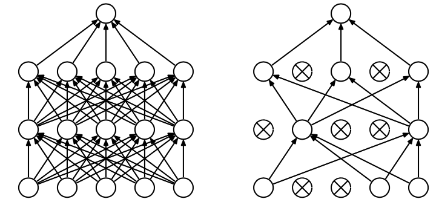
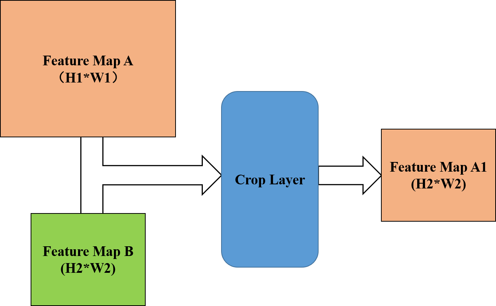
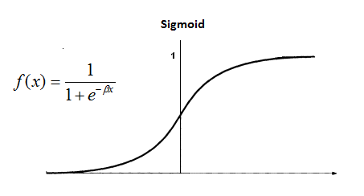

# Common Layers in Deep Learning
| Framework | Python | Official Documentation | 
| --- | --- | --- | 
| Caffe | 2.7 | [Caffe Layer Catalogue](http://caffe.berkeleyvision.org/tutorial/layers.html) |
| Pytorch | 2.7 | [Pytorch Documentation](http://pytorch.org/docs/nn.html) |


## Fully Connected Layer 全连接层
| Framework | Code | 
| --- | --- | 
| Caffe | type: "InnerProduct"| 
| Pytorch | torch.nn.Linear(in_features, out_features, bias=True) | 

<p align="center"></p> 

```
fc1 = nn.Linear(3,4)
fc2 = nn.Linear(4,1)
```

## Dropout Layer
| Framework | Code | 
| --- | --- | 
| Caffe | type: "Dropout"| 
| Pytorch | torch.nn.Dropout2d(p=0.5, inplace=False) | 

一种防止训练时过拟合的方法，在模型训练时随机让网络某些隐含层节点的权重不工作。

<p align="center"></p> 


## Convolution Layer 卷积层

### 2D Convolution

| Framework | Code | 
| --- | --- | 
| Caffe | type: "Convolution"| 
| Pytorch | torch.nn.Conv2d(in_channels, out_channels, kernel_size, stride=1, padding=0, dilation=1, groups=1, bias=True) | 

往往在以图像为输入的网络中使用。

#### 卷积原理

当卷积层的输入维度(Channel)大于1时：

<p align="center"></p>

```
Conv1 = nn.Conv2d(3, 2, kernel_size=(3, 3), stride=(2, 2), padding=(1, 1), dilation=1)
```

#### 卷积层中stride, padding, dilation参数意义：

<table style="width:100%">
  <tr>
    <td></td>
    <td></td>
    <td></td>
    <td></td>
  </tr>
  <tr>
    <td>No padding, no strides</td>
    <td>Arbitrary padding, no strides</td>
    <td>Half padding, no strides</td>
    <td>Full padding, no strides</td>
  </tr>
  <tr>
    <td></td>
    <td></td>
    <td></td>
    <td></td>
  </tr>
  <tr>
    <td>No padding, strides = 2</td>
    <td>Padding = 1, strides = 2</td>
    <td>Padding = 1, strides = 2 (odd)</td>
    <td></td>
  </tr>
  <tr>
    <td></td>
    <td></td>
    <td></td>
    <td></td>
  </tr>
  <tr>
    <td>No padding, no stride, dilation = 2</td>
    <td></td>
    <td></td>
    <td></td>
  </tr>
</table>

### 3D Convolution

| Framework | Code | 
| --- | --- | 
| Caffe | type: "Convolution", | 
| Pytorch | torch.nn.Conv3d(in_channels, out_channels, kernel_size, stride=1, padding=0, dilation=1, groups=1, bias=True) |

往往在以视频流为输入的网络中使用。

<p align="center"></p>

```
3DConv1 = nn.Conv3d( 1, n1, kernel_size=(d0, 3, 3), stride=(1, 1, 1), padding=(0, 1, 1))
3DConv2 = nn.Conv3d(n1, n2, kernel_size=(d0, 3, 3), stride=(1, 1, 1), padding=(0, 1, 1))
3DConv3 = nn.Conv3d(n2, n3, kernel_size=(d0, 3, 3), stride=(1, 1, 1), padding=(0, 1, 1))
3DConv4 = nn.Conv3d(n3, n4, kernel_size=(d0, 3, 3), stride=(1, 1, 1), padding=(0, 1, 1))
```

每个channel间参数不同，但每个channel内的视频流共享参数，如下图所示。

<p align="center"></p>


## Deconvolution Layer 反卷积层

| Framework | Code | 
| --- | --- | 
| Caffe | type: "Deconvolution"| 
| Pytorch | torch.nn.ConvTranspose2d(in_channels, out_channels, kernel_size, stride=1, padding=0, output_padding=0, groups=1, bias=True, dilation=1) | 

卷积层的逆操作，常用于将卷积层生成的特征图upsampling和decode，如下图所示。

<p align="center"></p>

#### 反卷积层中stride, padding参数意义：

<table style="width:100%">
  <tr>
    <td></td>
    <td></td>
    <td></td>
    <td></td>
  </tr>
  <tr>
    <td>No padding, no strides, transposed</td>
    <td>Arbitrary padding, no strides, transposed</td>
    <td>Half padding, no strides, transposed</td>
    <td>Full padding, no strides, transposed</td>
  </tr>
  <tr>
    <td></td>
    <td></td>
    <td></td>
    <td></td>
  </tr>
  <tr>
    <td>No padding, strides, transposed</td>
    <td>Padding, strides, transposed</td>
    <td>Padding, strides, transposed (odd)</td>
    <td></td>
  </tr>
</table>

## Max Pooling Layer 池化层

| Framework | Code | 
| --- | --- | 
| Caffe | type: "Pooling" pool: MAX| 
| Pytorch | torch.nn.MaxPool2d(kernel_size, stride=None, padding=0, dilation=1, return_indices=False, ceil_mode=False) | 

<p align="center"></p>

```
Pool1 = nn.MaxPool2d(3, 1, padding=0)
```

## RoI Pooling Layer

<p align="center"></p>

RoI Pooling层在论文[Fast R-CNN](http://www.cv-foundation.org/openaccess/content_iccv_2015/papers/Girshick_Fast_R-CNN_ICCV_2015_paper.pdf)中被提出，主要用于为大小不同的RoI(Region of Interest)区域提取大小相同的特征图，其主要过程为：
- 将RoI区域的坐标缩放到与特征图同一尺度，并对缩放后的坐标取整；
- 将缩放后的ROI区域分割为设定好的区域块（如7×7）；
- 对每个区域块内的特征值进行操作（一般是max pooling），并作为该区域块的最终输出。

[Implementation: RoI Pooling in Pytorch](https://discuss.pytorch.org/t/autograd-on-sampled-locations-on-feature-maps/1585/2)

## Max Unpooling Layer

| Framework | Code | 
| --- | --- | 
| Caffe | no official implementation, [Third-Party](https://github.com/HyeonwooNoh)| 
| Pytorch | torch.nn.MaxUnpool2d(kernel_size, stride=None, padding=0) | 

Max Pooling层的逆操作，其与Deconvlution层的区别如下图所示，Pooling层的输出是稀疏（sparse）的，后面往往要跟Convolution层来使特征图稠密化（dense）。

<p align="center"></p>

## Crop Layer
| Framework | Code | 
| --- | --- | 
| Caffe | type: "Crop"| 
| Pytorch | Tensor.contiguous() | 

<p align="center"></p>

Crop层功能如上图所示，输入为待剪裁特征图A，以及参考特征图B（需满足A尺寸大于B）。Crop层的输出特征图A1由输入A剪裁而来，其大小与B一致，剪裁的偏移量由设置决定。该层在FCN中多次出现，用来解决输入图像大小不一致的问题。caffe中可以使用专门的Crop层，Pytorch中直接对要剪裁的特征图tensor进行维度操作即可。

```
h[:, :, 19:19+x.size()[2], 19:19+x.size()[3]].contiguous() #x.size[2], x.size[3] 分别为参考特征图的高和宽
```

## Concatenate Layer
| Framework | Code | 
| --- | --- | 
| Caffe | type: "Concat"| 
| Pytorch | torch.cat(seq, dim=0)| 

将相同长宽的特征图拼接在一起，形成新的维度。
<p align="center"></p>

## Batch Normalization Layer
| Framework | Code | 
| --- | --- | 
| Caffe | type: "BatchNorm" and type: "Scale"| 
| Pytorch | torch.nn.BatchNorm2d(num_features, eps=1e-05, momentum=0.1, affine=True)| 

Batch Normalization解决的是[Internal Covariate Shift](https://arxiv.org/abs/1502.03167)问题，即由于每一层的参数都在不断变化，所以输出的分布也会不断变化，造成梯度需要不断适应新的数据分布。所以，每一个mini batch里，对每个维度进行归一化:

 

上式中的γ和β为可学习参数。

针对CNN中的高维特征，假设一个batch里的128个图，经过一个64 kernels卷积层处理，得到了128×64个特征图，再针对每一个kernel所对应的128个特征图，求它们所有像素的mean和variance，因为总共有64个kernels，输出的结果就因此为一维长度64的数组。

<p align="center"></p>

[BN效果为什么好？](https://www.zhihu.com/question/38102762)


## Reshape Layer
| Framework | Code | 
| --- | --- | 
| Caffe | type: "Reshape"| 
| Pytorch | torch.view, nn.PixelShuffle | 

在不改变特征数值和特征总量的情况下改变特征图的形状：

<p align="center"></p>

```
x = torch.randn(L*r*r, h, w)
y = x.view(L, r*h, r*w)
or
nn.PixelShuffle(r)
```


## Activation Function Layer

激活函数的作用是给神经网络加入一些非线性因素，使得神经网络可以更好地解决较为复杂的问题。

### Sigmoid
| Framework | Code | 
| --- | --- | 
| Caffe | type: "Sigmoid"| 
| Pytorch | torch.nn.Sigmoid | 

<p align="center"></p>

** 优点： **

- Sigmoid函数的输出映射在(0,1)(0,1)之间，单调连续，输出范围有限，优化稳定，可以用作输出层；
- 求导容易。

** 缺点： **
- 由于其软饱和性，容易产生梯度消失，导致训练出现问题；
- 其输出并不是以0为中心的。

### Tanh
| Framework | Code | 
| --- | --- | 
| Caffe | type: "TanH"| 
| Pytorch | torch.nn.Tanh | 

<p align="center"></p>

** 优点： **

- 比Sigmoid函数收敛速度更快；
- 相比Sigmoid函数，其输出以0为中心。

** 缺点： **
- 饱和性产生的梯度消失。

### ReLU
| Framework | Code | 
| --- | --- | 
| Caffe | type: "ReLU"| 
| Pytorch | torch.nn.ReLU | 

<p align="center"></p>

** 优点： **

- 相比起Sigmoid和tanh，ReLU在SGD中能够快速收敛；
- ReLU实现更加简单；
- 有效缓解了梯度消失的问题；
- 提供了神经网络的稀疏表达能力。

** 缺点： **
- 随着训练的进行，可能会出现神经元死亡，权重无法更新的情况。

### Softmax Layer
| Framework | Code | 
| --- | --- | 
| Caffe | type: "Softmax"| 
| Pytorch | torch.nn.Softmax | 

softmax用于多分类问题，比如0-9的数字识别，共有10个输出，而且这10个输出的概率和加起来应该为1，所以可以用一个softmax操作归一化这10个输出。进一步一般化，假如共有k个输出，softmax的假设可以形式化表示为：

<p align="center"></p>

softmax层往往用于多分类问题的最终输出层，用来输出各类的概率，如下图所示：

<p align="center"></p>

## Loss Function Layer 损失函数层

用来定义训练过程中的网络输出与真值不一致程度的函数。

### SoftmaxWithLoss Layer
class torch.nn.LogSoftmax + NLLLoss

### CrossEntropyLoss Layer

#### Multi-Class

#### Binary-Class

#### Classic


