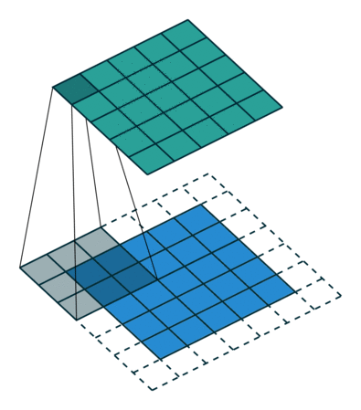

# Common Layers in Deep Learning
| Framework | Python | 
| --- | --- | 
| Caffe | 2.7 | 
| Pytorch | 2.7 | 


## Fully Connected Layer 全连接层
| Framework | Code | 
| --- | --- | 
| Caffe | type: "InnerProduct"| 
| Pytorch | torch.nn.Linear(in_features, out_features, bias=True) | 

<p align="center"></p> 

```
fc1 = nn.Linear(3,4)
fc2 = nn.Linear(4,1)
```


## Convolution Layer 卷积层

### 2D Convolution

| Framework | Code | 
| --- | --- | 
| Caffe | type: "Convolution"| 
| Pytorch | torch.nn.Conv2d(in_channels, out_channels, kernel_size, stride=1, padding=0, dilation=1, groups=1, bias=True) | 

往往在以图像为输入的网络中使用。

#### 卷积原理

当卷积层的输入维度(Channel)大于1时：

<p align="center"></p>

```
Conv1 = nn.Conv2d(3, 2, kernel_size=(3, 3), stride=(2, 2), padding=(1, 1), dilation=1)
```

#### 卷积层中stride, padding, dilation参数意义：

<table style="width:100%">
  <tr>
    <td></td>
    <td></td>
    <td></td>
    <td></td>
  </tr>
  <tr>
    <td>No padding, no strides</td>
    <td>Arbitrary padding, no strides</td>
    <td>Half padding, no strides</td>
    <td>Full padding, no strides</td>
  </tr>
  <tr>
    <td></td>
    <td></td>
    <td></td>
    <td></td>
  </tr>
  <tr>
    <td>No padding, strides = 2</td>
    <td>Padding = 1, strides = 2</td>
    <td>Padding = 1, strides = 2 (odd)</td>
    <td></td>
  </tr>
  <tr>
    <td></td>
    <td></td>
    <td></td>
    <td></td>
  </tr>
  <tr>
    <td>No padding, no stride, dilation = 2</td>
    <td></td>
    <td></td>
    <td></td>
  </tr>
</table>

### 3D Convolution

| Framework | Code | 
| --- | --- | 
| Caffe | type: "Convolution", | 
| Pytorch | torch.nn.Conv3d(in_channels, out_channels, kernel_size, stride=1, padding=0, dilation=1, groups=1, bias=True) |

往往在以视频流为输入的网络中使用。

<p align="center"></p>

```
3DConv1 = nn.Conv3d( 1, n1, kernel_size=(d0, 3, 3), stride=(1, 1, 1), padding=(0, 1, 1))
3DConv2 = nn.Conv3d(n1, n2, kernel_size=(d0, 3, 3), stride=(1, 1, 1), padding=(0, 1, 1))
3DConv3 = nn.Conv3d(n2, n3, kernel_size=(d0, 3, 3), stride=(1, 1, 1), padding=(0, 1, 1))
3DConv4 = nn.Conv3d(n3, n4, kernel_size=(d0, 3, 3), stride=(1, 1, 1), padding=(0, 1, 1))
```

每个channel间参数不同，但每个channel内的视频流共享参数，如下图所示。

<p align="center"></p>


## Deconvolution Layer 反卷积层

| Framework | Code | 
| --- | --- | 
| Caffe | type: "Deconvolution"| 
| Pytorch | torch.nn.ConvTranspose2d(in_channels, out_channels, kernel_size, stride=1, padding=0, output_padding=0, groups=1, bias=True, dilation=1) | 

卷积层的逆操作，常用于将卷积层生成的特征图upsampling和decode，如下图所示。

<p align="center"></p>

#### 反卷积层中stride, padding参数意义：

<table style="width:100%">
  <tr>
    <td></td>
    <td></td>
    <td></td>
    <td></td>
  </tr>
  <tr>
    <td>No padding, no strides, transposed</td>
    <td>Arbitrary padding, no strides, transposed</td>
    <td>Half padding, no strides, transposed</td>
    <td>Full padding, no strides, transposed</td>
  </tr>
  <tr>
    <td></td>
    <td></td>
    <td></td>
    <td></td>
  </tr>
  <tr>
    <td>No padding, strides, transposed</td>
    <td>Padding, strides, transposed</td>
    <td>Padding, strides, transposed (odd)</td>
    <td></td>
  </tr>
</table>

## Max Pooling Layer 池化层

| Framework | Code | 
| --- | --- | 
| Caffe | type: "Pooling" pool: MAX| 
| Pytorch | torch.nn.MaxPool2d(kernel_size, stride=None, padding=0, dilation=1, return_indices=False, ceil_mode=False) | 

<p align="center"></p>

```
Pool1 = nn.MaxPool2d(3, 1, padding=0)
```

## RoI Pooling Layer

<p align="center"></p>

RoI Pooling层在论文[Fast R-CNN](http://www.cv-foundation.org/openaccess/content_iccv_2015/papers/Girshick_Fast_R-CNN_ICCV_2015_paper.pdf)中被提出，主要用于为大小不同的RoI(Region of Interest)区域提取大小相同的特征图，其主要过程为：
- 将RoI区域的坐标缩放到与特征图同一尺度，并对缩放后的坐标取整；
- 将缩放后的ROI区域分割为设定好的区域块（如7×7）；
- 对每个区域块内的特征值进行操作（一般是max pooling），并作为该区域块的最终输出。

[Implementation: RoI Pooling in Pytorch](https://discuss.pytorch.org/t/autograd-on-sampled-locations-on-feature-maps/1585/2)

## Max Unpooling Layer
| Framework | Code | 
| --- | --- | 
| Caffe | no official implementation, [Third-Party](https://github.com/HyeonwooNoh)| 
| Pytorch | torch.nn.MaxUnpool2d(kernel_size, stride=None, padding=0) | 

Max Pooling层的逆操作，其与Deconvlution层的区别如下图所示，Pooling层的输出是稀疏（sparse）的，后面往往要跟Convolution层来使特征图稠密化（dense）。

<p align="center"></p>

h[:, :, 19:19+x.size()[2], 19:19+x.size()[3]].contiguous()
1111


<script type="text/javascript"
  src="https://cdn.mathjax.org/mathjax/latest/MathJax.js?config=TeX-AMS-MML_HTMLorMML">
</script>

<p>$$x=\frac{-b\pm\sqrt{b^2-4ac}}{2a}$$</p>


http://www.sciweavers.org/free-online-latex-equation-editor

http://mathurl.com/
